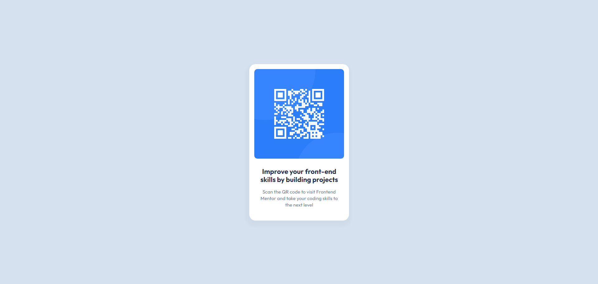
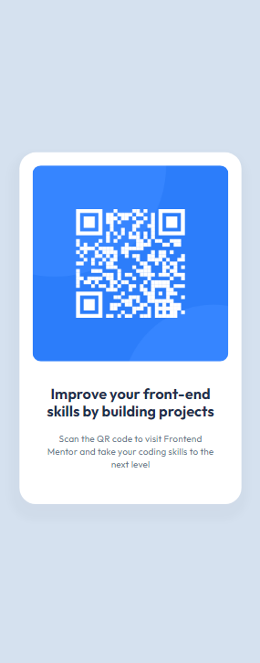
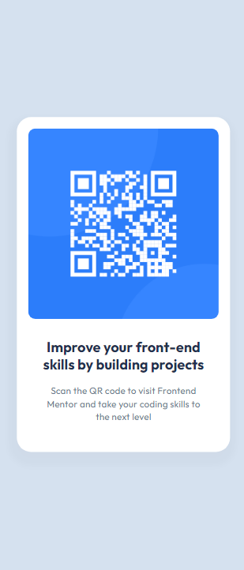

# My solution for Frontend Mentor qr-code-component challenge

## Table of contents

- [Overview](#overview)
  - [Screenshot](#screenshot)
  - [Links](#links)
- [My process](#my-process)
  - [Built with](#built-with)
  - [What I learned](#what-i-learned)
  - [Continued development](#continued-development)
  - [Useful resources](#useful-resources)
- [Author](#author)

## Overview

### Screenshot

Desktop view:


Mobile view:

- 320px



- 350px
  

### Links

- Live site URL: [qr-code-component-challenge](https://tadanama.github.io/qr-component/)

## My process

### Built with

- HTML
- CSS
- Flexbox
- Media query

### What I learned

Here are some of the things that I learned while doing this challenge.

1. How to vertically and horizontally a div with flexbox

- First, we have to ensure that the height of the body is 100vh so that it has room to vertically center the div

```css
body {
	/* Set the height to 100vh(full browser height) so that it has room to vertically align */
	min-height: 100vh;

	/* Vertically and horizontally center qr-container */
	display: flex;
	justify-content: center;
	align-items: center;
}
```

2. How to make the website responive (with media query).

- Change the size of the qr-container, header and paragraph font-size when screen size is small

```html
<div class="qr-container">
	
	<h1>Improve your front-end skills by building projects</h1>
	<p>
		Scan the QR code to visit Frontend Mentor and take your coding skills to the
		next level
	</p>
</div>
```

```css
@media only screen and (max-width: 350px) {
	.qr-container {
		width: 300px;
	}

	h1 {
		font-size: 20px;
	}

	p {
		font-size: 13px;
	}
}

@media only screen and (max-width: 320px) {
	.qr-container {
		width: 270px;
	}

	h1 {
		font-size: 18px;
	}

	p {
		font-size: 11px;
	}
}
```

### Continued development

The things that i want to focus on the future projects are:

- Flexbox - I want to understand more how flex-grow, flex-shrink and flex-basis work.
- Grid - I want to understand how to use grid to make complex layout
- Decide when to use flexbox and grid and what are their advantages and disadvantages
- Responsive CSS - I want to know the methods of making the website more responsive
- Clean code - I want to learn how approach html and css to write more clean and maintanable code

## Author

- Frontend Mentor - [@tadanama](https://www.frontendmentor.io/profile/tadanama)
